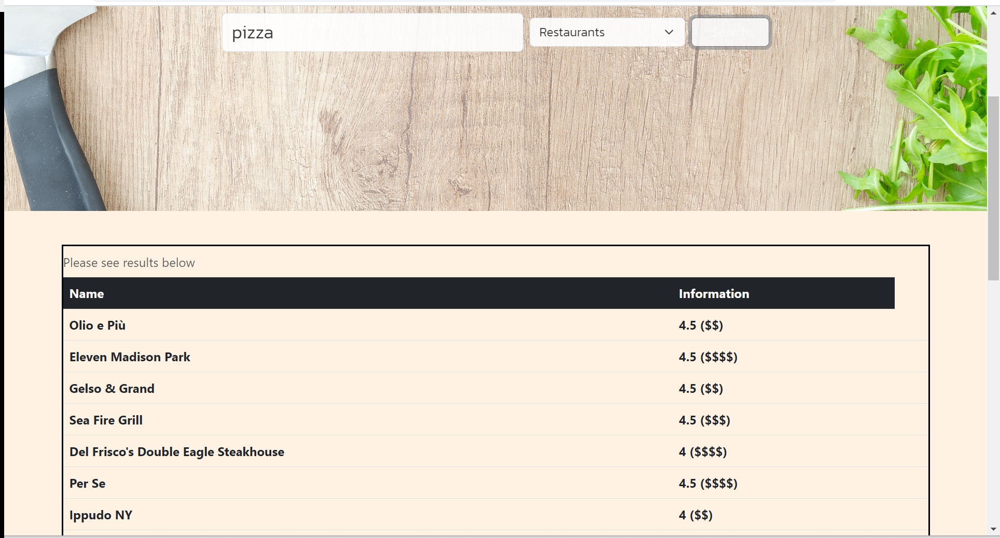

# Restaurants and Recipes


## Description 

Food is something that universally brings everyone together, so we thought it would be a great idea to bring together two different ways one could go about getting food. Preparing it at home with recipes, or going out to restaurants.

## User Story

```
AS A User
I WANT to see a Food Search Website with options to get food from restaurants or the recipe to prepare it at home.
```

## Acceptance Criteria

```
GIVEN a Food Website with select inputs.
WHEN I search for the food of my choice by selecting the options Restaurants.
THEN I am presented with 15 nearby restaurants in a table format with the restaurant name, price, and rating.
WHEN I search for the food of my choice by selecting the options Recipes.
THEN I am presented with the Recipe name and number of servings.
```

## Usage
On page load, there is a simple and easy to navigate website.


In the search bar, you can type in your parameters. Then choose whether you would like to see options from restaurants or from recipes. They will appear in a neat table below the main feature image.




To review this Site Creation, you can review the notes in each section. Open the Chrome DevTools by pressing Command+Option+I (macOS) or Control+Shift+I (Windows). A console panel should open either below or to the side of the webpage in the browser.

## Deployed URL

https://timdolan14.github.io/Restaurants-and-Recipes/

## Github Repo

https://github.com/timdolan14/Restaurants-and-Recipes

## Group Presentation 
[Google Slides](https://docs.google.com/presentation/d/1IZzhYuBtBhhLbr7KKr_VHl9eSFKKwpIwBlNStQcJ4Kw/edit#slide=id.gcb9a0b074_1_0)

## Collaborators:

- Tim Dolan
- Devonta Henderson
- Marni Luka
- Reshma Paul


## Technologies Used

This Website was created using the Yelp API and Ninja API. Bootstrap and CSS was used for styling.

[Yelp API](https://api.yelp.com/v3/businesses)

[Ninjas API](https://api.api-ninjas.com)

[Bootstrap CSS Framework](https://cdn.jsdelivr.net/npm/bootstrap@5.3)
